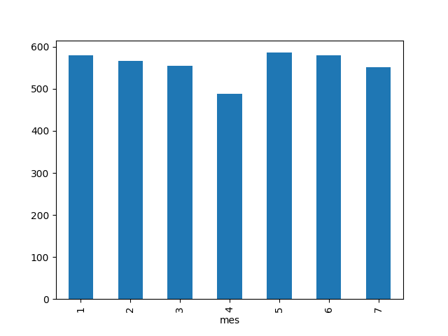

# Analisis-de-Ventas-E-commerce

Este proyecto esta creado para hacer un analisis de ventas de un dataset de un E-commerce, usando un analisis simple para poder tomar mejores decisiones respecto a las ventas

## 🛠️ Herramientas
- Python
- pandas
- numpy
- matplotlib

## 📈 Análisis realizado
- Ventas promedio por país
- Ventas por categoría
- Evolución temporal
- Relación entre clientes y ventas

## 🔍 Insights

- No se observa un patrón claro por mes debido a la naturaleza aleatoria del dataset.
- No existe una correlación significativa entre clientes y ventas.
- Algunas categorías muestran mayor volumen de ventas que otras.

## 📷 Ventas por Categoria

## 🤑 Correlacion de ventas por cliente

## 🚀 Conclusión
Proyecto enfocado en práctica de data wrangling, análisis exploratorio y visualización.
